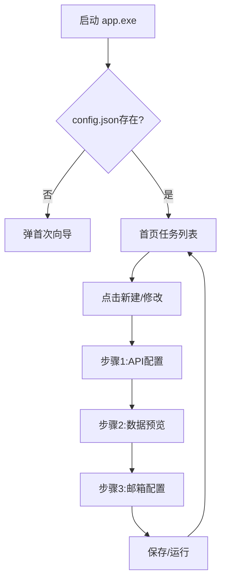
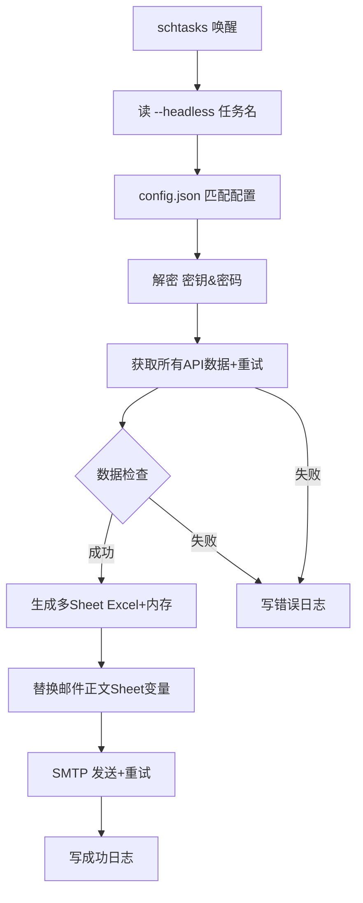

# 百川数据助手项目需求书

## 一、项目背景

当前取数流程依赖人工登录数据库、运行SQL、下载Excel、发送邮件，重复性高且易出错。本工具通过“一键配置 + Windows任务计划”实现完全自动化，兼顾安全、易用、可维护，交付单文件绿色版，可在公司任何 Windows 10/11 电脑即插即用。

## 二、技术栈与架构

| 类别     | 技术/工具                | 说明                                                                    |
| -------- | ------------------------ | ----------------------------------------------------------------------- |
| GUI框架  | CustomTkinter            | 现代UI组件，提供良好用户体验（支持多页面、步骤引导、弹窗、多API配置）。 |
| 网络请求 | requests                 | 发送POST请求获取API数据，支持代理、SSL校验配置、多API并发。             |
| 数据处理 | pandas + openpyxl        | JSON转DataFrame、字段校验、多Sheet Excel生成、内存数据处理。            |
| 邮件发送 | smtplib + email          | 构造/发送带Excel附件的邮件，支持HTML正文变量替换、重试。                |
| 加密存储 | cryptography(Fernet)     | 对称加密保护邮箱密码、apikey、app_secret（密文存储）。                  |
| 后台调度 | Windows任务计划程序      | 通过schtasks.exe实现任务注册、删除、状态查询、周计划支持。              |
| 配置存储 | config.json + secret.key | 任务列表与加密密钥，支持多API配置、Sheet名称配置。                      |
| 打包部署 | PyInstaller              | 生成 `app.spec`，打包后后输出 `dist\app.exe`。                      |
| 日志     | logging                  | 写同级 `app.log`，按天轮转保留30天，敏感字段脱敏。                    |
| 缓存管理 | 内存缓存                 | 多API数据缓存，避免重复请求，提高执行效率。                             |

## 三、文件与目录约定

```
<部署根目录>
├─ 百川数据助手.exe       # 单文件绿色版，最终交付物
├─ 项目操作文档.md         # 用户操作手册，最终交付物
├─ secret.key             # 首次运行生成，AES-128密钥，隐藏属性
├─ config.json            # 任务列表（支持多API配置、Sheet名称配置）
├─ app.log                # 运行日志
├─ locks/                 # 任务锁文件目录（隐藏属性）
│   └─ <taskName>.lock    # 任务执行锁文件
└─ data/                  # 生成的Excel附件目录（全局路径）
    └─ <taskName>_<date>.xlsx
```

**路径规则**

- 所有路径均使用 `Path(__file__).parent`定位exe目录，再拼出 `data\`绝对路径，确保被任务计划调用时不会错位。
- 中文长路径自动加 `\\?\`前缀，避免260字符限制。

## 四、功能需求

### FR1 首次运行向导

- 若 `config.json`不存在或空，启动后自动弹出“新建任务向导”。

### FR2 任务管理首页

- 卡片列表展示任务，含名称、API域名、收件人数量、Sheet信息、定时状态。
- 操作：新建、修改、单次运行、注册/管理/注销定时、删除。
- 单选任务后，底部操作按钮才可用。

### FR3 三步骤配置向导

① API配置 → ② 数据预览 → ③ 邮箱配置

- **步骤1：API配置**
  - 支持为单个任务配置多个API接口（`api_configs`数组）。
  - 每个API可独立配置URL、Headers（含apikey/app_secret）、超时等。
  - API名称可自定义（默认API1、API2等）。
  - 支持动态添加/删除API配置（至少保留一个）。
  - 提供单个API测试连接功能，不使用缓存，实时验证。
- **步骤2：数据预览**
  - 支持为每个API配置对应的Sheet名称。
  - 自动生成包含多个Sheet的Excel文件。
  - Sheet名称支持自定义，自动处理非法字符。
  - 支持预览多个Sheet的数据内容，以标签页形式展示。
  - 可下载预览数据到本地。
  - 可自定义Excel文件名，支持占位符。
- **步骤3：邮箱配置**
  - 配置发件人、密码、收件人、抄送人、主题、正文HTML、附件名。
  - 支持在邮件正文中使用 `{Sheet1}`、`{Sheet2}`等变量，发送时自动替换为对应Sheet的HTML表格（预览前10行）。
  - 支持“发送测试邮件”功能。
- **保存与运行**
  - 保存：校验所有输入 → 加密敏感字段 → 写入 `config.json` → 刷新首页。
  - 测试运行：立即执行一次全链路，弹窗提示结果，不保存配置。

### FR4 加密存储

- 首次运行生成 `secret.key`（AES-128），并设置为隐藏属性。
- **apikey、app_secret、邮箱密码**在保存到 `config.json`时，均使用Fernet加密。
- 程序运行时在内存中解密使用，解密失败会提示用户重新输入。
- 日志中所有敏感字段（密码、密钥等）在输出时显示为 `***`。

### FR5 数据获取与文件生成

- API请求超时默认为30秒，支持配置代理（proxy）和SSL证书校验（`verify_ssl`）。
- API返回的JSON数据将转换为pandas DataFrame。
- **支持多个API数据生成多Sheet Excel**，每个API对应一个Sheet。
- **正式任务在 `data/<taskName>_<date>.xlsx`生成Excel**（使用绝对路径），无临时文件。
- 支持在内存中直接生成Excel文件流，用于邮件附件，避免磁盘I/O。

### FR6 邮件发送

- SMTP端口可配（默认587，STARTTLS）。
- 支持HTML格式正文、多收件人、抄送/密送。
- 附件大小超过1MB时，在日志中记录KB数。
- 邮件发送失败会自动重试3次，间隔5秒，若最终失败则记录ERROR日志。

### FR7 失败重试与任务锁

- 任务执行前，在 `locks/` 目录下创建锁文件 `<taskName>.lock`（包含PID和时间戳），任务结束后自动删除。若锁文件存在且未超时（1小时），则跳过本次执行。
- **数据缓存**：为每个API独立缓存DataFrame数据，避免在同一次任务执行中（如预览后立即发送）重复请求。任务结束后缓存自动清理。
- **重试机制**：API请求或邮件发送环节发生异常时，会自动重试3次。
- **容错**：多API任务中，单个API的失败不应中断整个任务流程，但会在日志中详细记录错误。

### FR8 定时调度（Windows任务计划）

- **注册**：GUI通过调用 `schtasks /Create` 命令创建定时任务。
  - 任务命令: `"<path_to_exe>\百川数据助手.exe" --headless "<任务名>"`
  - 支持“每日”和“每周”两种频率。
  - 每周计划支持选择周一至周日的任意组合。
- **注销**：调用 `schtasks /delete` 命令删除任务。
- **状态同步**：程序启动时，通过 `schtasks /query` 查询所有 `KW_` 前缀的任务，并更新UI上的定时状态图标。
- **Headless模式**：`--headless` 参数使程序在后台无窗口运行，仅输出日志。

### FR9 多任务独立机制

- 每个任务对应一条独立的schtasks记录，命令行通过唯一的任务名区分。
- 程序启动时通过 `argparse` 解析 `--headless <任务名>`，并从 `config.json` 中匹配对应的配置。
- 锁文件、输出文件名均包含任务名，确保不同任务之间不会发生冲突。

### FR10 日志与审计

- 日志格式：`YYYY-MM-DD HH:MM:SS | LEVEL | Message`。
- 记录关键操作：任务开始/结束、API请求、文件生成、邮件发送。
- 异常信息会记录完整的堆栈跟踪。
- 日志文件按天轮转，自动保留最近30天。

### FR11 动态占位符

- 支持在 **文件名**、**邮件主题**、**邮件正文** 中使用以下占位符，程序在运行时会自动替换：
  - `{date}`: 当前日期，格式为 `YYYYMMDD`。
  - `{taskName}`: 当前执行的任务名称。

## 五、非功能需求

| 维度 | 要求                                                                          |
| ---- | ----------------------------------------------------------------------------- |
| 安全 | 密钥本地仅存；日志脱敏；任务锁防并发。                                        |
| 易用 | 首次向导+三步配置+测试邮件+必填校验+多API多Sheet配置。                        |
| 可靠 | 重试+异常捕获+锁文件+全局路径+多API容错。                                     |
| 性能 | 10万行×20列数据处理内存占用合理；生成文件大小无硬性限制；支持多API并行处理。 |
| 兼容 | Windows 10 21H2+/11；无需管理员权限；支持U盘运行。                            |

## 六、流程图

### 6.1 GUI总览



### 6.2 后台 headless 流程



## 七、交付材料

1. **可执行程序**: `百川数据助手.exe`
2. **操作文档**: `项目操作文档.pdf`
