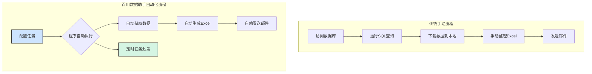
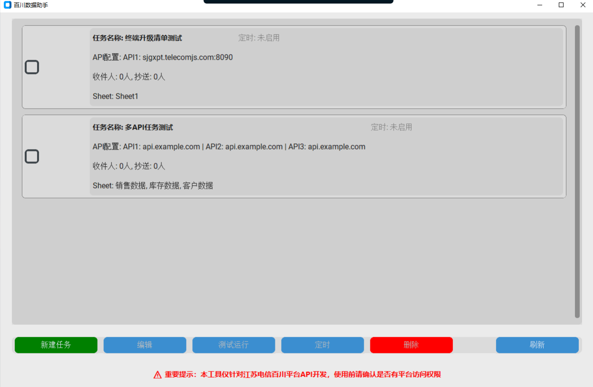
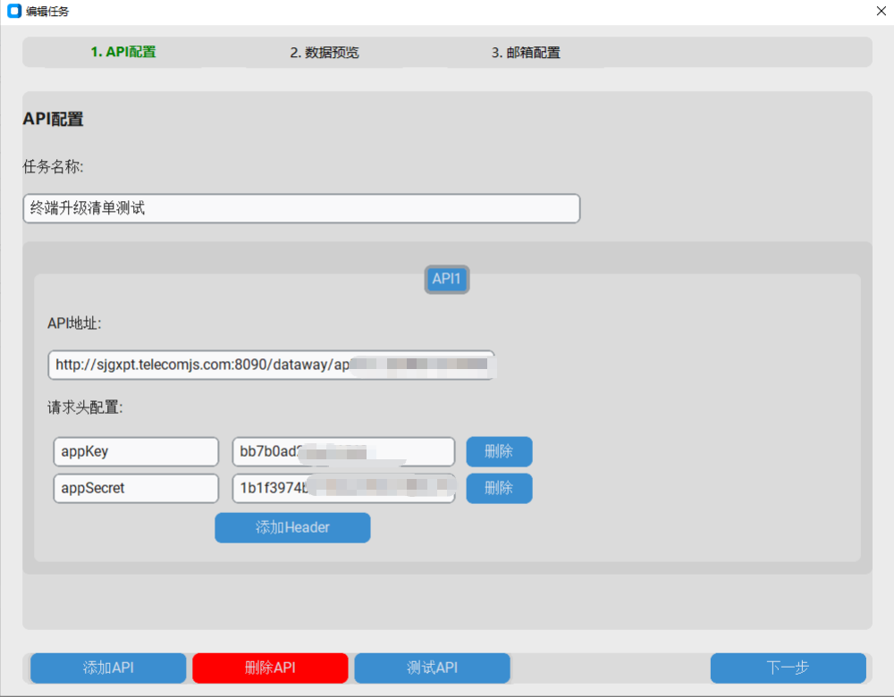
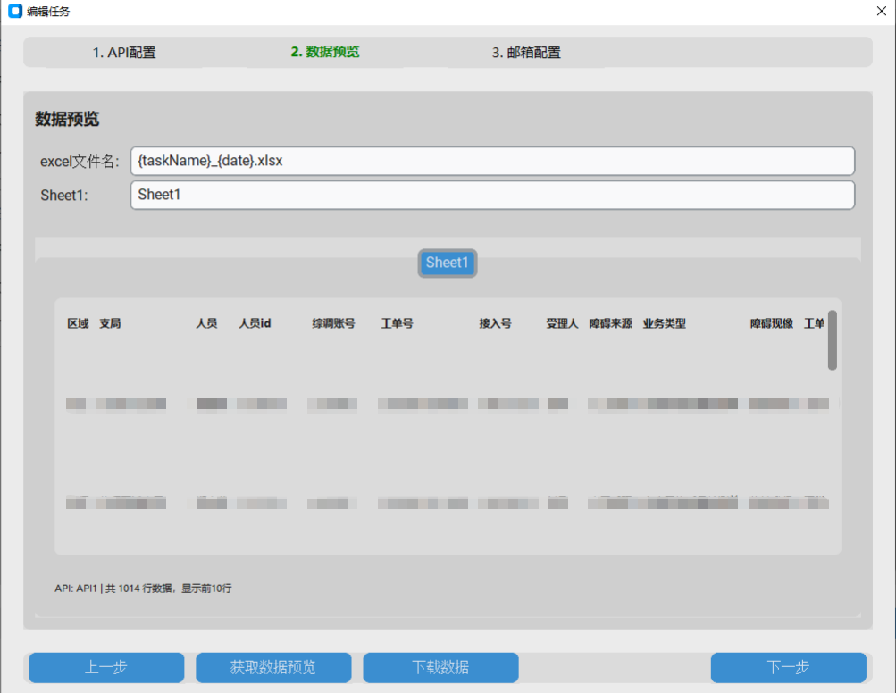
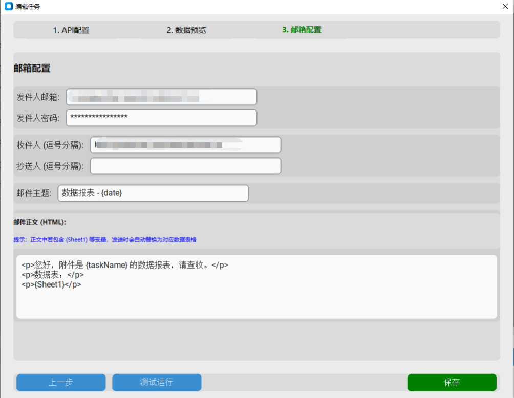
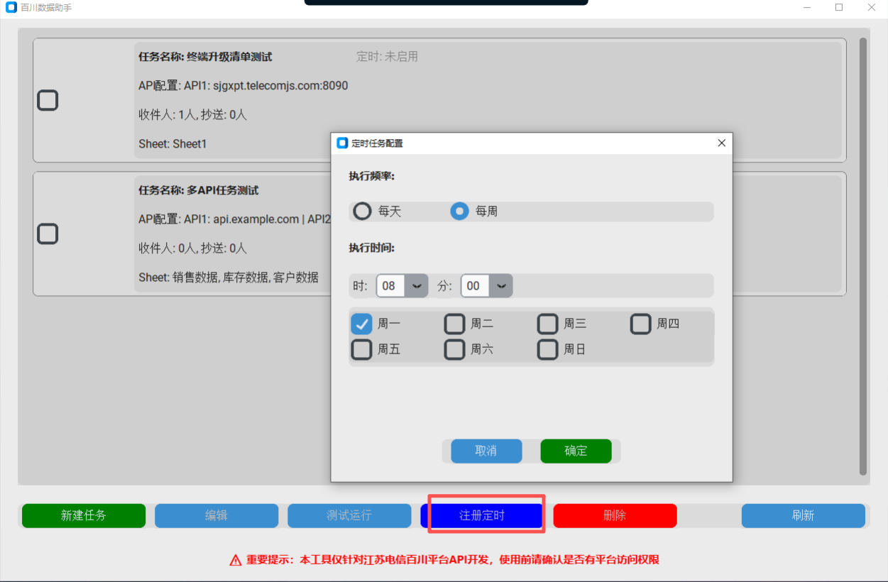
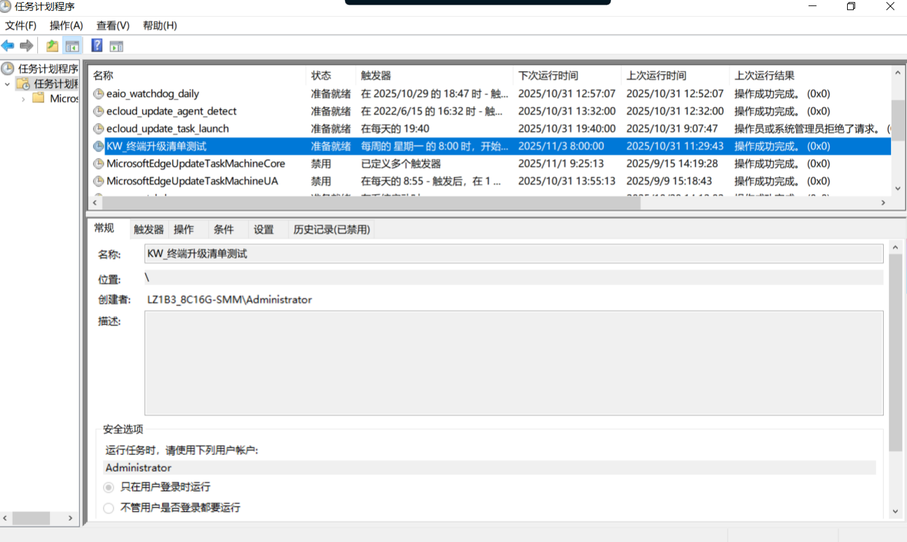
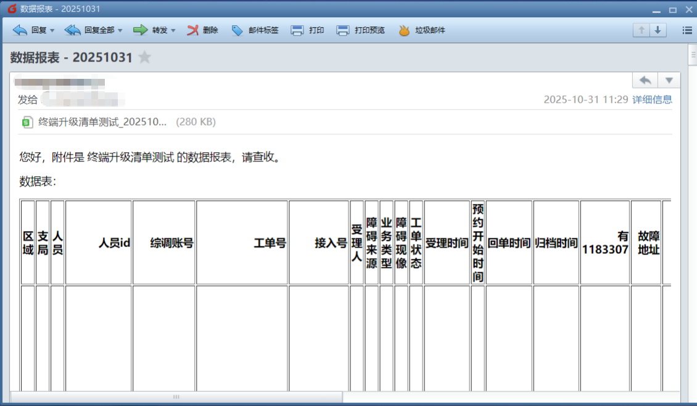

# 百川数据助手操作文档

## 一、产品概述

百川数据助手是一款数据自动化处理工具，旨在将繁琐的日常取数工作变得简单、高效。

### 以前，您可能需要这样工作：

访问数据库 -> 手动运行查询 -> 下载数据到本地 -> 整理Excel -> 手动发送邮件

这个过程不仅耗时，而且容易出错。

### 现在，有了百川数据助手，流程简化为：

**一次配置，永久自动！**

您只需进行简单的设置，程序就能自动完成所有工作：

自动获取数据 -> 自动生成Excel报表 -> 自动发送邮件

更棒的是，您可以结合Windows的“任务计划程序”功能，设置定时任务（例如每天上午8点自动执行），彻底解放您的双手！

## 二、系统要求

- **操作系统**：Windows 10 或 Windows 11。
- **运行环境**：无需安装，解压后直接运行，也可以放在U盘里使用。

## 三、快速操作指南

请按照以下步骤，一步步完成您的第一个自动化任务。

### 第1步：启动程序和新建任务

1. 双击文件夹中的 `百川数据助手.exe` 文件启动程序。
2. 您会看到程序的主界面。点击 **“新建任务”** 按钮开始创建。

### 第2步：配置数据源

在这一步，我们需要告诉程序去哪里获取数据。

1. **任务名称**：给您的任务起一个好记的名字，例如“每日销售数据”。
2. **API配置**：
   * 点击 **“添加API”**。
   * **API地址**：将百川平台提供的API地址完整地粘贴到这里。
   * **请求头**：点击 **“添加”** 按钮，将百川平台提供的 `apikey` 和 `appsecret` 等信息分别填入。
   * **测试API**：点击此按钮，程序会尝试连接并获取数据。如果提示“连接成功”，说明配置无误。

### 第2.1步：(进阶) 配置多个数据源

如果您需要从多个不同的数据接口汇总数据（例如，一个任务需要同时获取“销售数据”和“库存数据”），您可以添加多个API。

1. 在API配置区域，再次点击 **“添加API”** 按钮，会出现一个新的API配置卡片（默认为 `API 2`）。
2. 仿照第一个API的配置方法，填写第二个API的 **API地址** 和 **请求头** (`apikey`, `appsecret` 等)。
3. 您可以为每个API单独命名，方便区分。
4. 配置完成后，在下一步的预览界面，您将看到来自不同API的数据被分别放在了不同的Sheet页中。最终生成的Excel文件和发送的邮件也会包含所有这些Sheet的内容。

### 第3步：预览和设置Excel文件

数据源配置成功后，我们可以预览数据，并设置最终生成的Excel文件名。

1. **Excel文件名**：您可以自定义文件名，程序很智能，支持使用 `{taskName}`（任务名称）和 `{date}`（当天日期）作为变量，例如 `销售日报_{date}`。
2. **Sheet名称**：您可以为从不同接口获取的数据分别命名，例如“一部销售数据”、“二部销售数据”。
3. **获取数据预览**：点击此按钮，您将看到从接口返回的数据表格。
4. **下载数据**（可选）：如果您想立即下载这份预览数据，可以点击此按钮。

### 第4步：配置邮件自动发送

现在，我们来设置如何自动发送包含数据的邮件。

1. **发件人信息**：
   * 填写您用来发送邮件的 **邮箱地址** 和 **邮箱密码**（密码会自动加密，请放心填写）。
2. **收件人信息**：
   * **收件人**：填写接收邮件的邮箱地址，如果有多人，请用英文逗号 `,` 隔开。
   * **抄送人**（可选）：如果需要抄送给其他人，请填写在此处。
3. **邮件内容**：
   * **邮件主题**：和Excel文件名一样，支持变量。
   * **邮件正文**：您可以编写邮件内容，并使用 `{Sheet1}`、`{Sheet2}` 这样的变量。发送时，程序会自动将这些变量替换成对应的数据表格。
   * **附件名称**：设置邮件中Excel附件的名称。

### 第5步：设置定时任务

这是实现“全自动”的关键一步！

1. 在主界面的任务卡片上，点击 **“定时”** 按钮。
2. **执行频率**：选择“每日”或“每周”。
3. **执行时间**：设置您希望任务自动执行的具体时间。
4. **注册定时**：点击此按钮，程序会自动为您在Windows中创建一个定时计划。创建成功后，按钮会变为“管理定时”。

### 第6步：在Windows中查看定时任务

您可以随时在Windows的“任务计划程序”中查看或管理已创建的定时任务。

1. 打开Windows开始菜单，搜索“任务计划程序”并打开。
2. 在这里，您可以看到所有由“百川数据助手”创建的定时任务（以 `KW_` 开头）。

### 第7步：成功！自动接收邮件

设置完成后，到了指定时间，您的收件箱就会自动收到由程序发送的数据邮件，附件中是最新生成的Excel报表。

## 四、问题与帮助

如果您在使用过程中遇到任何问题，例如程序无法启动、任务执行失败、邮件发送不成功等，请不要担心。

请按照以下步骤联系技术支持：

1. 在程序所在的文件夹中，找到一个名为 `app.log` 的文件。这个文件记录了程序的运行日志。
2. 将 `app.log` 文件作为附件，发送邮件给开发人员 **黄维申**。
3. **邮箱地址**：`huangweishen.js@chinatelecom.cn`

开发人员会根据日志文件帮您定位并解决问题。
