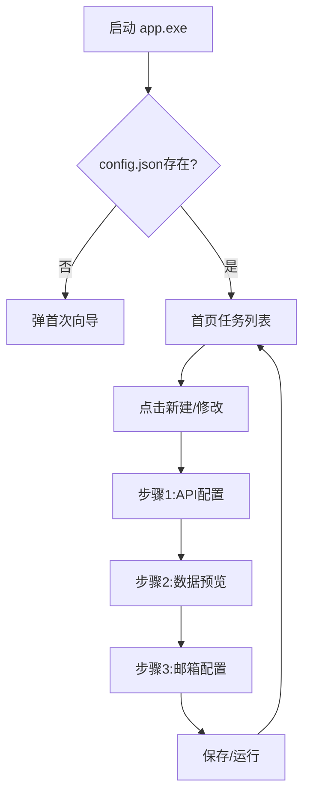
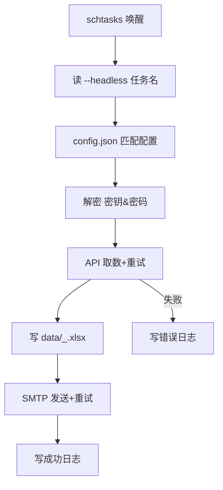

# 百川数据助手项目需求书

## 一、项目背景

当前取数流程依赖人工登录数据库、运行SQL、下载Excel、发送邮件，重复性高且易出错。本工具通过“一键配置 + Windows任务计划”实现完全自动化，兼顾安全、易用、可维护，交付单文件绿色版，可在公司任何 Windows 10/11 电脑即插即用。

## 二、技术栈与架构

| 类别     | 技术/工具                | 说明                                                         |
| -------- | ------------------------ | ------------------------------------------------------------ |
| GUI框架  | CustomTkinter            | 现代UI组件，提供良好用户体验（支持多页面、步骤引导、弹窗）。 |
| 网络请求 | requests                 | 发送POST请求获取API数据，支持代理、SSL校验配置。             |
| 数据处理 | pandas + openpyxl        | JSON转DataFrame、字段校验、在 `data/`目录生成Excel。       |
| 邮件发送 | smtplib + email          | 构造/发送带Excel附件的邮件，支持重试。                       |
| 加密存储 | cryptography(Fernet)     | 对称加密保护邮箱密码、apikey、app_secret（密文存储）。       |
| 后台调度 | Windows任务计划程序      | 通过schtasks.exe实现任务注册、删除、状态查询。               |
| 配置存储 | config.json + secret.key | 任务列表与加密密钥，全部位于exe同目录。                      |
| 打包部署 | PyInstaller              | 生成 `app.spec`，打包后后输出 `dist\app.exe`。           |
| 日志     | logging                  | 写同级 `app.log`，按天轮转保留30天，敏感字段脱敏。         |

## 三、文件与目录约定

```
<部署根目录> 
├─ app.py	      # 项目主程序
├─ app.spec           # 打包脚本（留档）
├─ version_info.txt   # 版本信息
├─ secret.key         # 首次运行生成，AES-128密钥，隐藏属性
├─ config.json        # 任务列表（敏感字段加密）
├─ app.log            # 运行日志
├─ build              # 打包中间目录（留档）
├─ dist               # 打包输出目录（留档）
    └─ app.exe        # 单文件绿色版，可在任何Windows 10/11电脑即插即用
└─ data/              # 生成的Excel附件目录（全局路径）
    ├─ SalesDaily_20251029.xlsx
    └─ <taskName>_<date>.xlsx
```

**路径规则**

- 所有路径均使用 `Path(__file__).parent`定位exe目录，再拼出 `data\`绝对路径，确保被任务计划调用时不会错位。
- 中文长路径自动加 `\\?\`前缀，避免260字符限制。

## 四、功能需求

### FR1 首次运行向导

- 若 `config.json`不存在或空，启动后自动弹出“新建任务向导”。

### FR2 任务管理首页

- 卡片列表展示任务，含名称、API域名、收件人数量、状态图标。
- 操作：新建、修改、单次运行、注册/注销定时、删除。

### FR3 三步骤配置向导

① API配置 → ② 数据预览 → ③ 邮箱配置

- 步骤1：URL、Headers（含apikey/app_secret）、预览行数；下一步即调用API，失败弹窗。
- 步骤2：表格预览；可下载到 `data/`；可改文件名。
- 步骤3：发件人、密码、收件人、主题、正文HTML、附件名；支持“发送测试邮件”。
- 保存：校验 → 加密敏感字段 → 写config.json → 刷新首页。
- 运行：立即执行一次全链路，弹窗结果，不保存配置。

### FR4 加密存储（扩展至API密钥）

- 首次运行生成 `secret.key`（AES-128），隐藏属性。
- **apikey、app_secret、邮箱密码**全部Fernet加密后落盘，解密失败提示重输。
- 日志中敏感字段显示为 `***`。

### FR5 数据获取与文件生成

- 超时30s，可配proxy & verify_ssl。
- JSON转DataFrame后校验非空+必填字段，缺失弹窗字段名。
- **正式任务在 `data/<taskName>_<date>.xlsx`生成Excel**（全局路径），无临时文件。

### FR6 邮件发送

- SMTP端口可配（默认587，STARTTLS）。
- 支持HTML正文、多收件人、抄送/密送。
- 附件≥1MB记录KB数；发送失败重试3次，间隔5s，仍失败写ERROR。

### FR7 失败重试与任务锁

- 运行前写 `data/<taskName>.lock`（含PID+时间），结束删除；存在则跳过并写INFO。
- API/SMTP任意环节异常均重试，全部失败写ERROR。

### FR8 定时调度（Windows任务计划）

- 注册：GUI调用
  ```
  schtasks /Create /TN "KW_<taskName>" /TR "\"<root>\app.exe\" --headless <taskName>" /SC DAILY /ST 18:00 /F
  ```
- 注销：调用 `schtasks /delete /tn "KW_<taskName>" /f`。
- 状态同步：启动时 `schtasks /query`匹配 `KW_`前缀，更新卡片图标。
- headless模式：`app.exe --headless <taskName>`无窗口运行，仅日志输出。

### FR9 多任务独立机制

1. 一任务一条schtasks记录，命令行携带**唯一任务名**。
2. exe启动时通过 `argparse`读取 `--headless 任务名`，去 `config.json`匹配对应配置段。
3. 锁文件、输出文件名均含任务名，杜绝冲突。
4. 同任务并发→锁文件直接退出；不同任务互不干扰。

### FR10 日志与审计

- 格式：`2025-10-29 18:00:01 | INFO | start task SalesDaily`
- 异常写堆栈；敏感字段脱敏；30天自动清理。

### FR11 动态占位符

- 支持 `{date}` `{taskName}`在文件名、邮件主题、正文中自动替换。

## 五、非功能需求

| 维度 | 要求                                       |
| ---- | ------------------------------------------ |
| 安全 | 密钥本地仅存；日志脱敏；任务锁防并发。     |
| 易用 | 首次向导+三步配置+测试邮件+必填校验。      |
| 可靠 | 重试+异常捕获+锁文件+全局路径。            |
| 性能 | 10万行×20列≤200MB内存；生成文件≤50MB。  |
| 兼容 | Windows 10 21H2+/11；无需管理员；U盘运行。 |

## 六、流程图

### 6.1 GUI总览



### 6.2 后台 headless 流程


